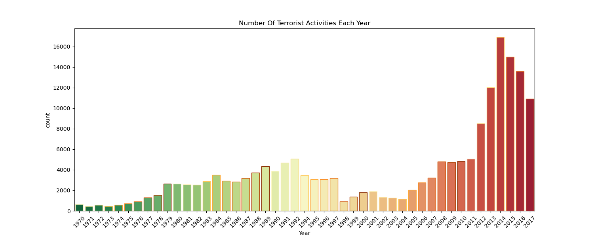
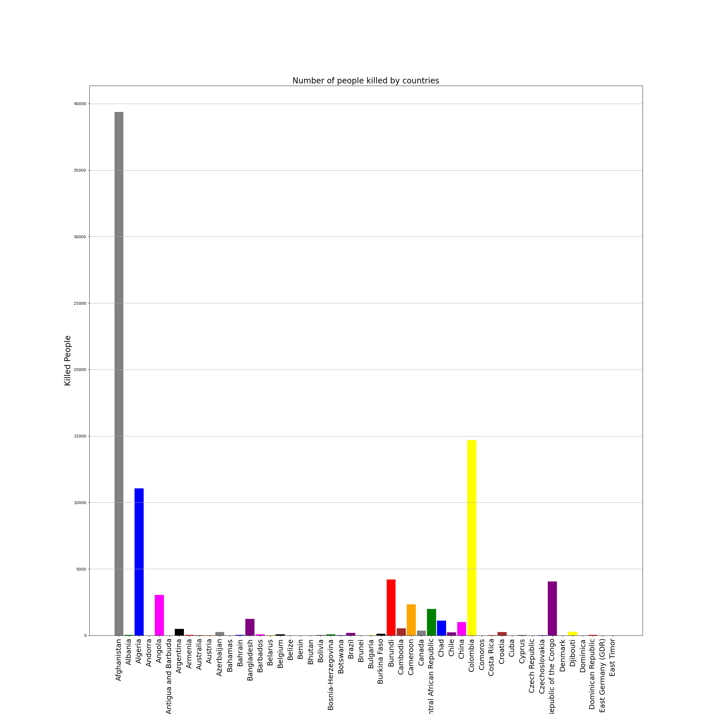
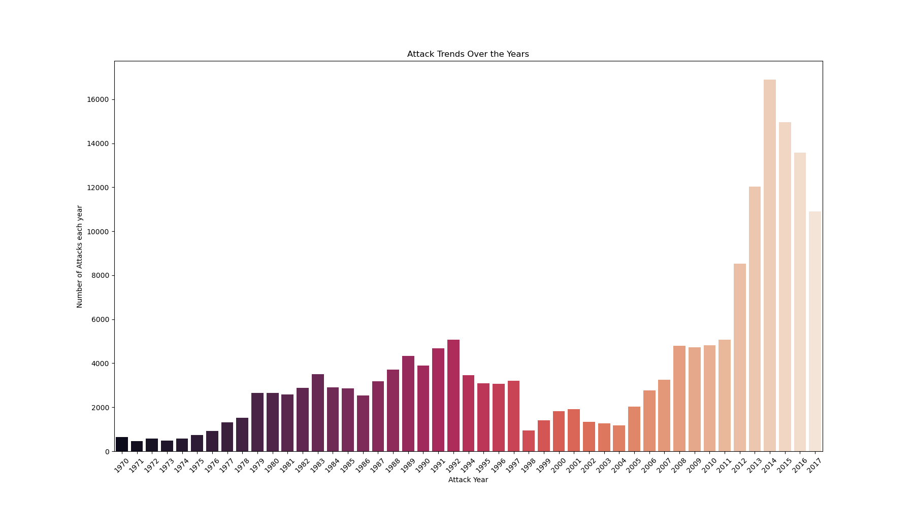

# EDA of the Global Terrorism Database: Hotspots, Groups & Attack Patterns

## 📌 Overview  
This project performs an Exploratory Data Analysis (EDA) on the **Global Terrorism Database (GTD)**, which contains over 181,000 records of terrorist attacks worldwide from 1970 to 2017. The analysis uncovers patterns, trends, and insights into the evolution of global terrorism.  

- **Cleaned and prepared** a large, complex dataset (135 columns, 181K+ records) for analysis  
- **Created new features** (e.g., casualties) to quantify the human cost of attacks  
- **Analyzed** temporal, geographical, and categorical patterns of terrorism  
- **Visualized** hotspots, trends, and group activities using Matplotlib, Seaborn, and Folium  
- **Derived** actionable insights on regions, groups, and attack types most affected by terrorism  

---

## ⚙️ Tech Stack  
- **Python (Jupyter Notebook)**: Core analysis environment  
- **Pandas & NumPy**: Data cleaning, preprocessing, and feature engineering  
- **Matplotlib & Seaborn**: Statistical plots and trend visualizations  
- **Folium**: Interactive mapping of terrorist attack locations  
- **Kaggle Dataset**: Global Terrorism Database (1970–2017)  

---

## 🔑 Key Analyses & Visuals  

### 1️⃣ Yearly Attack Trends  
 
- **Finding:** Terrorist incidents increased dramatically over the decades, with a sharp rise after 2010.  

---

### 2️⃣ Casualties by Country  
 
- **Finding:** Iraq, Afghanistan, and Pakistan recorded the highest number of terrorism-related deaths, highlighting that terrorism disproportionately impacts these regions.  

---

### 3️⃣ Attack Trends Over Time  
 
- **Finding:** Bombing/Explosion and Armed Assault consistently emerge as the most frequent and lethal attack types worldwide.  

---

## 📈 Key Insights  
- **Hot Zones:** Iraq, Afghanistan, and Pakistan account for the highest frequency of attacks and casualties  
- **Escalation:** Significant increase in terrorist activity after 2010  
- **Lethal Methods:** Bombing/Explosion and Armed Assault dominate global fatalities  
- **Major Groups:** Taliban and ISIL are responsible for a disproportionate share of attacks  
- **Victims:** Muslim-majority countries are disproportionately affected  

---

## 📌 Learning Outcomes  
- Experience in **end-to-end EDA** on a large real-world dataset  
- Skills in **data wrangling, cleaning, and feature engineering**  
- Ability to **uncover hidden patterns** using advanced visualization libraries  
- Strengthened **analytical storytelling** by linking terrorism data to real-world events  

---

## 🔮 Future Enhancements  
- Extend dataset with **recent years (post-2017)** for updated insights  
- Apply **predictive modeling** to forecast attack frequency and hotspots  
- Use **NLP techniques** to analyze text-based data (attack summaries, motives)  
- Deploy results on a **dashboard (Tableau, Streamlit, or Dash)** for interactive exploration  

---

